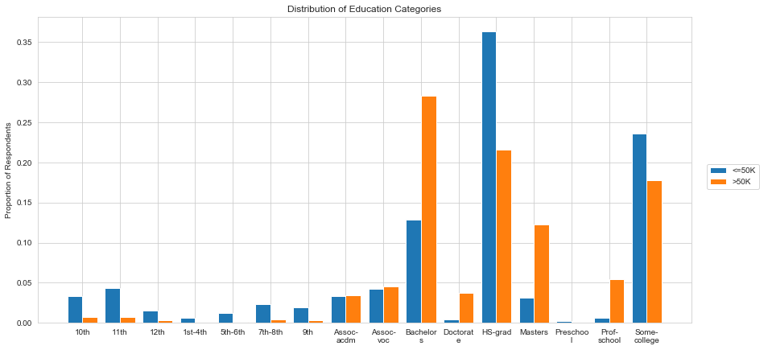

# Data Insights

This report presents some interesting facts about the data. 

I am only describing the training data, as it's the one I will use to fit my model later. Moreover, the test dataset has a similar distribution of its variables, so most of the facts stated below are correct for the test set too.


## Variable Description
In this first part, I am describing each variable's distribution, using some basic statistics and distribution plots. I am also looking at the direct effect of each covariate on the response variable: whether a respondent has more than $50k. I am using statistical tests to measure the difference in distribution between the "<=50k" class and the ">50k" class.


#### Age
```
mean: 38.6      std:  13.4
min:  17        max:  90
25%:  28        50%:  37        75%:  47
```

Let's describe the distribution for **age**:
- The youngest respondents are 17 years old (`min`), and the oldest are 90 years old (`max`). The range is 73 years.  
- On average, the respondents are 38.6 yo (`mean`), and the standard deviation is 13.4 years (`std`).
- 25% of the respondents are less or equal to 28 yo, and 25% are more or equal to 47 yo.
- In particular, half of the respondents are younger than 37 years old. 


We can see on the density plot that the respondents are mainly distributed between 17 and 60 years old. Most of the respondents are quite young, but the older people have greater age than average, creating asymmetry.

The age distribution of people in the ">50k" class is significantly higher than for the "<=50k". In particular, the age peaks at around 40 yo for the higher class, and around 25 yo for the lower class. 


#### Capital Gain & Loss
```
Capital Gain:
mean: 1088.5    std:  7469.0
min:  0         max:  99999
25%:  0         50%:  0         75%:  0

Capital Loss:
mean: 88.2      std:  403.9
min:  0         max:  4356
25%:  0         50%:  0         75%:  0
```

More than 75% of the respondents have not declared any capital gain or loss. However, there are still people who declared big amounts of capital: the maximum values are high, 99,999 USD for capital gain, and 4,356 USD for capital loss. The means are high because of those great values, and I would advise again using the mean for those variables as it is not robust.

 

We can see on the density plot that most of the respondents have not declared any capital gain or loss. More than 91% of the respondents have not declared a capital gain, and 95% have not declared a capital loss. On the other end, 0.5% have declared the maximum value of capital gain, $99,999, which explains the bump around that value on the density.

For both variables, the distributions for "<=50k" are more dense around 0 than the ones for "<50k", and has less density on the upper tail.


#### Hours per week
```
mean: 40.7      std:  12.2
min:  1         max:  99
25%:  40        50%:  40        75%:  45
```

The lowest value you can declare seems to be 1 hour, and the highest value is 99 hours. At least 25% of the respondents declared working exactly 40 hours per week, and more than half are working between 40 and 45 hours a week. 


We can see on the density plot that the respondents are mainly distributed between 30 and 55 hours a week, with a very high density at 40 hours. The slope between 0 and 20 shows that there are quite a lot of people working a few hours a week, most likely part-timers. On the other side, the slope decreases quickly, showing that very few people work many hours.

The distribution for hours-per-week of people in the ">50k" class is significantly higher than for the "<=50k":
- the lower values (between 1 and 20 hours) are more often declared by people from the lower class, 
- the upper values (between 60 and 99 hours) are more often declared by people from the upper class.  


#### Workclass


Most of the respondents are working in the **private sector**. People working for the private sector represent 77% of the "<=50k" class and 65% of the ">50k" class. The other categories over-representing the class "<=50k" are "Never-worked" and "Without-pay," but both have very few respondents. 

The other categories have less than 10% of the respondents each. People in those categories are more likely to be in the ">50k" class than average. In particular, the "self-employed-inc" work class represents 8% of the ">50k" class but only 2% of the "<=50k" class.


#### Education


The most represented education level is "HS-grad" with more than 30% of the respondents, followed by "Some-college" (22%) and "Bachelors" (16%).  
The lowest levels of education have very few respondents: 509 for 5th and 6th grades, 247 for 1st to 4th grades, and only 83 for Preschool. 

People who never finished high school (grade 12th and under), HS grads, and college students are more present in the class "<=50k". In particular, HS grads represent more than 36% of the "<=50k" but only 22% of the ">50k". The difference is even higher for the lower levels of education.

People who graduated from university are more likely to be in the ">50k" class than average. For example, the Bachelors represents 28% of the ">50k" class but only 13% of the "<=50k" class. For the Masters, it's 12% of the ">50k" and only 3% of the "<=50k".


#### Marital Status


The main category is *Married - Civilian* with more than 45% of the respondents, followed by *Never married* (33%). The least used category is "Married - Armed Forces" with only 37 respondents.

Never married people are more likely to be in the "<=50k" class than average. They represent more than 40% of the "<=50k" class but only 7% of the ">50k" class.  
Married people - civilian and AF - are more present in the class ">50k". In particular, they represent 85% of the ">50k" but only 34% of the "<=50k".


#### Occupation


The most-represented occupations are *Prof-specialty*, *Craft-repair* and *Executive Managerial*, each with a little more than 12% of the respondents.  
The least represented occupations are *Armed Forces* and *Private House Services*, with both less than 1% of respondents.

Farmers, fishers, cleaners and other service are more likely to be in the "<=50k" class than average. For example, cleaners represent more than 5% of the "<=50k" class but less than 1% of the ">50k" class.  
Executive managers, professional specialists and salesmen are more present in the class ">50k". In particular, executive managers represent 26% of the ">50k" but only 9% of the "<=50k".


#### Race

|  Proportion for      | ">50k"  |  Proportion for      | "<=50k" |
|---------------------:|---------|---------------------:|---------|
|  White               |  91.1%  |  White               |  84.3%  |
|  Black               |  4.9%   |  Black               |  10.8%  |
|  Asian-Pac-Islander  |  3.3%   |  Asian-Pac-Islander  |  2.9%   |
|  Amer-Indian-Eskimo  |  0.4%   |  Amer-Indian-Eskimo  |  1.1%   |
|  Other               |  0.3%   |  Other               |  0.9%   |


The most-represented race is *White*, with 85% of the respondents.  
The least-represented are Amer-Indians and Eskimos with less than 1%. Nearly 1% of the respondents are from minorities that don't have their own category.

Black people and Amer-Indians are more likely to be in the "<=50k" class than average. For example, Black people represent 11% of the "<=50k" class but less than 5% of the ">50k" class.  
White people are a little more present in the class ">50k". They represent more than 90% of the ">50k" and 84% of the "<=50k".


#### Sex
|  Proportion for  | ">50k"  |  Proportion for  | "<=50k" |
|-----------------:|---------|-----------------:|---------|
|  Male            |  85.2%  |  Male            |  61.7%  |
|  Female          |  14.8%  |  Female          |  38.3%  |

Overall, 67% of the respondents are men, and 33% are women.

Women are more likely to be in the "<=50k" class than average. They represent 38% of the "<=50k" class but less than 15% of the ">50k" class.  
Men are more in the class ">50k". They represent more than 85% of the ">50k" but only 62% of the "<=50k".


#### Native Country
More than 90% of the respondents were born in the USA. 2% were born in Mexico. The other countries count for less than 1% each.

People that were born in Mexico are more present in the "<=50k" class.  
People in the States, Philippines, and Germany are more likely to be in the class ">50k".

Since most countries in the list have very few people, I decided to group them by geographical area. The new distributions for those groups are:

|  Proportion for  | ">50k"  |  Proportion for  | "<=50k" |
|-----------------:|---------|-----------------:|---------|
|  north-america   |  93.6%  |  north-america   |  90.9%  |
|  asia            |  2.9%   |  asia            |  2.2%   |
|  europe          |  2.0%   |  europe          |  1.5%   |
|  carribean       |  0.7%   |  carribean       |  1.5%   |
|  mexico          |  0.4%   |  mexico          |  2.5%   |
|  south-america   |  0.3%   |  south-america   |  1.4%   |

Now we can see more clearly that people born in Mexico, on a Carribean Island or in South America are more likely to be in the "<=50k" class than average. In particular, people born in Mexico represent 2.5% of the "<=50k" class but only 0.4% of the ">50k" class.  
On the other hand, people born in North America, Europe or Asia are slightly more present in the class ">50k". 


## Overview of Class Detection
The goal is to explain the earning class ("<=50k" and ">50k") by the other variables. For this, I fit some simple models on the full set to observe what variable explains the classification the most. 

Like for native countries, categorical variables have too many categories. To make the interpretation more straightforward, I've grouped some categories.

### Logistic Regression
The logistic regression looks at the effect of each variable on the earning class. The effect is measured by a coefficient and a p-value for each numeric variable and each category of categorical variables. If the coefficient is positive, it means that people in this category are more likely to earn more. The effect is said significant if the p-value is low.

```
Coefficients:
                                     Estimate  z-value    p-value
(Intercept)                        -6.863e+00  -11.166    < 2e-16 ***
age                                 2.252e-02   13.518    < 2e-16 ***
workclass  - Local-gov             -7.131e-01   -6.418   1.38e-10 ***
workclass  - Private               -5.120e-01   -5.563   2.65e-08 ***
workclass  - Self-emp-inc          -3.722e-01   -3.053   0.002267 ** 
workclass  - Self-emp-not-inc      -1.086e+00  -10.103    < 2e-16 ***
workclass  - State-gov             -8.457e-01   -6.849   7.43e-12 ***
workclass  - Unemployed            -1.228e+01   -0.101   0.919765
marital    - Married                2.284e+00    8.985    < 2e-16 ***
marital    - Never-married         -3.865e-01   -4.553   5.28e-06 ***
marital    - Separated             -5.470e-02   -0.339   0.734796
marital    - Widowed-Spouse-abs     2.157e-03    0.016   0.987197
occupation - Craft-repair          -4.289e-02   -0.545   0.586097
occupation - Exec-managerial        7.765e-01   10.267    < 2e-16 ***
occupation - Handlers-cleaners     -8.040e-01   -5.602   2.11e-08 ***
occupation - Office-service         3.406e-01    4.437   9.12e-06 ***
occupation - Other-occupation      -6.106e-01   -6.618   3.65e-11 ***
occupation - Other-service         -8.814e-01   -7.546   4.50e-14 ***
occupation - Prof-specialty         4.934e-01    6.144   8.07e-10 ***
occupation - Protective-serv        5.495e-01    4.387   1.15e-05 ***
occupation - Transport-moving      -1.940e-01   -1.974   0.048413 *
relation   - Not-in-family          1.829e-01    0.730   0.465252
relation   - With-relative         -9.194e-01   -4.263   2.02e-05 ***
race       - Asian-Pac-Islander     1.486e-01    0.892   0.372543
race       - Black                 -1.027e-01   -1.352   0.176256
race       - Amer-Indian-Eskimo    -6.196e-01   -2.751   0.005942 ** 
race       - Other                 -5.584e-01   -1.868   0.061752 .
sex        - Male                   1.620e-01    3.010   0.002614 ** 
capital.gain                        3.175e-04   30.135    < 2e-16 ***
capital.loss                        6.394e-04   16.771    < 2e-16 ***
hours.per.week                      2.668e-02   16.095    < 2e-16 ***
nat.count  - carribean              1.643e-01    0.618   0.536549
nat.count  - europe                 4.769e-01    2.134   0.032815 *
nat.count  - Mexico                -3.098e-01   -1.091   0.275469
nat.count  - north-america          3.404e-01    1.841   0.065585 .
nat.count  - south-america         -5.376e-01   -1.663   0.096242 .
education  - 5th-9th                3.983e-01    0.775   0.438106
education  - 10th-12th              9.366e-01    1.844   0.065245 .
education  - HS-grad                1.715e+00    3.430   0.000603 ***
education  - Assoc                  2.070e+00    4.115   3.87e-05 ***
education  - Bachelors              2.676e+00    5.338   9.42e-08 ***
education  - Masters                3.002e+00    5.948   2.71e-09 ***
education  - Doc-prof               3.640e+00    7.125   1.04e-12 ***
------------
    Null deviance: 33850  on 30160  degrees of freedom
Residual deviance: 19844  on 30118  degrees of freedom
(2399 observations deleted due to missingness)
AIC: 19930
```

All the variables have an overall significant effect on the prediction of the earning class. The variables with the most overall effect on the class detection are **capital-gain**, **occupation** and **education**. On the other hand, **race** and **sex** have a significant effect on the class detection, but way smaller than for the other variables.

*Capital Gain* has a significant positive effect on the class. It means that between two people with the same profile, the person that gained more capital is more likely to earn >50k than the person with less capital gain.

*Occupation* effect is measured by reference to *adm-clerical*. *Other-service* are significantly the least likely to earn >50k, with a coefficient of -0.9. *Executive-managerial* are significantly the most likely to earn >50k with a coefficient of 0.8. 

*Education* effect is measured by reference to *before-4th*, people that did go further than 4th grade. *before-4th* are the least likely to earn >50k. *Doctorate-Prof-school* are significantly more likely to earn >50k with a coefficient of 3.6. We notice that the coefficients of the two following categories are quite close, meaning that the effect is not significantly different between the two. However, between the lowest and the highest categories, the effect is more than significantly different.

The *age* has a significant, positive effect on the class (p-value < 2e-16). It means that between two people with the same profile, but different age, the older is more likely to earn >50k than the younger.

*Workclass* effect is measured compared to the reference group *Federal government*. All the other categories have a negative effect on the earning class, meaning that Federal-government is the most likely to earn more. The least likely to earn >50k is the Unemployed class (never-worked and without-pay) with a coefficient of -10. All the coefficients are significant, except for the *Unemployed* class since its size is small.

*Marital Status* effect is measured by reference to *Divorced*. *Never-married* are significantly the least likely to earn >50k, with a coefficient of -0.4. *Married* (civilian and AF) are significantly the most likely to earn >50k with a coefficient of 2.3. We notice that *Separated* and *Widowed-Spouse-absent* have a small effect, not significantly different from the divorced category.


### Decision Tree
The regression is great to get the effect of each variable on the class detection. With a decision tree, we can identify criteria to split the data into groups labelled "<=50k" or ">50k". 

|  variable        |  importance  |  |  variable        |  importance  |
|-----------------:|--------------|--|-----------------:|--------------|
|  marital.status  |  2440        |  |  sex             |  839         |
|  relationship    |  2418        |  |  hours.per.week  |  765         |
|  age             |  1301        |  |  capital.loss    |  417         |
|  educ            |  1242        |  |  workclass       |  240         |
|  capital.gain    |  1222        |  |  race            |  82          |
|  occupation      |  904         |  |  native.country  |  65          |

While building the decision tree, the algorithm gives each variable its importance according to how much it helps to split the data into the classes. For the tree, the most important variables are *relationship* and *marital status*. Race and native country are the least important. 

The error rate decreases while the tree grows more in-depth and becomes more complex. The minimum error we can achieve with one simple tree on this data is 58%. Below is the tree cut at an error rate of around 60%. The dark green nodes are mainly people earning less than 50k, and the dark blue ones are people earning more than 50k.


The first split is between people in a Married relationship (Wife and Husband) and the others. 
- Left: 55% of the respondents; among them, 93% earning <=50k, and 7% earning >50k,
- Right: 45% of the respondents; among them, 55% earning <=50k, and 45% earning >50k.

The second and final split on the left tree is "Capital Gain < $7,074".   
The second split on the right tree is about education, with University Graduate students against the others.

In the end, the two most useful groups are:
- **1st Leaf** - People not in a married relationship and with a capital gain lower than 7k: 
    - they represent 54% of all respondents,
    - among them, 95% are earning less than 50k a year.  
**=>** It's a reliable indicator of people that should not be detected by the model as potential donors.
- **Last Leaf** - People in a married relationship and who graduated from university (Bachelors, Masters, Doctorate or Prof-school):
    - they represent 14% of all respondents,
    - among them, 72% are earning more than 50k a year.  
**=>** It's a reliable indicator of people that could be detected by the model as potential donors.

